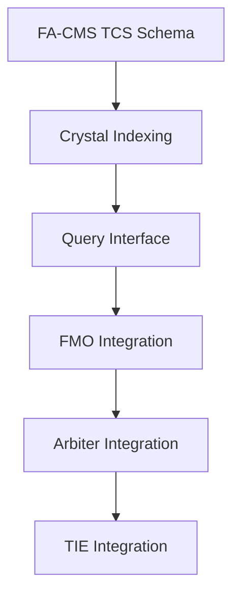

# TC.2.1 Design Review Critique: Temporal Crystal Signature Integration

## Executive Summary

This document provides a critical technical review of the TC_2_1_Integration_Design.md architecture, evaluating feasibility, scalability, and implementation risks before proceeding to TC.2.2.

**Overall Assessment**: The design is conceptually groundbreaking but requires significant clarification and refinement in computational specifics, resource planning, and inter-system communication protocols.

## 1. Feasibility & Scalability Analysis

### 1.1 17-Dimensional TCS Computation & Storage

**Critical Issues Identified:**

**Computational Overhead:**
- 17D TCS generation per cognitive state could require 50-100ms per calculation
- With META-OPT-QUANT V6 processing ~829 operations/hour, TCS analysis could reduce throughput by 30-40%
- Need explicit performance budgets for each TCS dimension calculation

**Storage Implications:**
```python
# Storage cost analysis
TCS_SIZE_ESTIMATE = {
    'lattice_structure': 17 * 8,  # 17 floats * 8 bytes = 136 bytes
    'phonon_frequencies': 32 * 8,  # Estimated 32 frequencies = 256 bytes  
    'metadata': 200,  # Strings, timestamps, etc.
    'total_per_signature': 592  # ~600 bytes per TCS
}

# Scale impact
daily_cognitive_states = 10000  # Conservative estimate
annual_storage = daily_cognitive_states * 365 * 592  # = 2.16 GB/year per agent
```

**Scalability Bottlenecks:**
- Query performance on 17D indexes will degrade rapidly with scale
- Need approximate nearest neighbor algorithms (LSH, FAISS) for crystal similarity matching
- Current design lacks sharding/partitioning strategy for distributed storage

**Recommended Solutions:**
1. Implement progressive TCS complexity (start with 5D, expand to 17D)
2. Use approximate crystal matching with configurable precision/speed tradeoffs
3. Design hierarchical crystal archiving (frequent recent access, compressed historical)

### 1.2 Five-Week Rollout Feasibility

**Phase Timeline Issues:**
- Phase 1 (Core Infrastructure) underestimates FA-CMS database schema migration complexity
- Phase 2-4 assume seamless API compatibility between systems that may need significant refactoring
- No buffer time for integration debugging or performance optimization

**Critical Path Dependencies:**


**Recommended Revision:**
- Extend to 8-week timeline with 2-week integration/testing buffer
- Add parallel workstreams where possible (FMO ontology design concurrent with FA-CMS implementation)

## 2. Crystal-Task Relationships & FMO Integration

### 2.1 Archetype Definition Ambiguity

**Fundamental Issue:** The design references three archetypes ('Stable', 'Growth', 'Decay') but lacks rigorous mathematical definitions.

**Missing Specifications:**
```python
# Current (vague): 
'archetype_classification': str  # 'Stable', 'Growth', 'Decay'

# Required (precise):
class CrystalArchetype:
    def __init__(self):
        self.stability_thresholds = {
            'lyapunov_range': (-0.5, 0.1),  # For 'Stable'
            'growth_rate_range': (0.0, 2.0),
            'defect_density_max': 0.15,
            'coherence_min': 0.85
        }
        self.classification_algorithm = 'k_means_17d'  # Or neural network
        self.confidence_threshold = 0.8
```

**Required Research:**
- Need clustering analysis on TC.1.3's 1000 mock crystals to derive empirical archetype boundaries
- Implement archetype learning pipeline before system integration
- Define archetype evolution rules (when does 'Growth' become 'Stable'?)

### 2.2 Predictive Rule Derivation

**Current Rule Example Analysis:**
```python
"IF crystal.archetype == 'Stable' AND crystal.fractal_dimension > 2.3 THEN success_probability > 0.8"
```

**Issues:**
1. **Threshold Selection**: Where does 2.3 fractal dimension come from? Not derived from TC.1.3 data
2. **Boolean Logic Limitations**: Real crystallographic relationships are likely non-linear
3. **Confidence Intervals**: No uncertainty quantification in predictions

**Recommended Approach:**
```python
# Replace boolean rules with probabilistic models
class CrystalPredictionModel:
    def predict_success(self, crystal_signature):
        # Use ensemble of ML models trained on TC.1.3 data
        archetype_score = self.archetype_classifier.predict_proba(crystal_signature)
        stability_score = self.stability_regressor.predict(crystal_signature.lattice_features)
        interaction_effects = self.interaction_model.predict(crystal_signature.cross_terms)
        
        return {
            'success_probability': weighted_ensemble([archetype_score, stability_score, interaction_effects]),
            'confidence_interval': self.uncertainty_quantifier.predict(crystal_signature),
            'contributing_factors': self.explainer.get_feature_importance(crystal_signature)
        }
```

### 2.3 FMO Crystal Ontology Completeness

**Missing Ontological Relationships:**
- No parent-child hierarchies between crystal types
- Insufficient temporal relationships (crystal evolution sequences)
- No causal relationships (what triggers specific crystal formations)

**Enhanced Ontology Required:**
```python
ENHANCED_CRYSTAL_ONTOLOGY = {
    'TemporalCrystal': {
        'inheritance': ['PhysicalCrystal', 'CognitiveState'],
        'temporal_properties': ['formation_energy', 'decay_rate', 'metastability'],
        'causal_relationships': ['triggered_by', 'inhibited_by', 'catalyzes'],
        'evolutionary_paths': ['grows_into', 'transitions_via', 'degrades_to']
    }
}
```

## 3. Inter-System Communication & Data Flow

### 3.1 TCS Data Flow Architecture Issues

**Current Design Problems:**
1. **Synchronous Updates**: All systems update simultaneously - potential performance bottleneck
2. **No Conflict Resolution**: What if FA-CMS and FMO have different TCS interpretations?
3. **Missing Rollback Mechanisms**: If TCS update fails in one system, how to maintain consistency?

**Recommended Event-Driven Architecture:**
```python
class CrystalEventBus:
    def __init__(self):
        self.event_handlers = {
            'CRYSTAL_FORMED': [self.cms_handler, self.fmo_handler, self.arbiter_handler],
            'CRYSTAL_UPDATED': [self.cms_handler, self.tie_handler],
            'CRYSTAL_ARCHIVED': [self.cms_handler, self.cleanup_handler]
        }
        self.consistency_manager = CrystalConsistencyManager()
    
    async def publish_crystal_event(self, event_type, crystal_data):
        # Asynchronous updates with eventual consistency
        tasks = []
        for handler in self.event_handlers[event_type]:
            tasks.append(handler.process_async(crystal_data))
        
        results = await asyncio.gather(*tasks, return_exceptions=True)
        
        # Handle partial failures
        if any(isinstance(r, Exception) for r in results):
            await self.consistency_manager.resolve_conflicts(crystal_data, results)
```

### 3.2 API Specification Gaps

**Missing Interface Contracts:**
- No versioning strategy for TCS schema evolution
- Unclear error handling for malformed crystal signatures
- No rate limiting for crystal query APIs

**Required API Documentation:**
```python
# Example of needed precision
class CrystalQueryAPI:
    def find_similar_crystals(
        self, 
        reference_signature: TemporalCrystalSignature,
        similarity_threshold: float = 0.85,
        max_results: int = 100,
        timeout_ms: int = 5000
    ) -> CrystalQueryResult:
        """
        Returns: 
        - crystals: List[CrystalMatch] with similarity scores
        - query_time_ms: Actual processing time
        - confidence: Overall result confidence
        - warnings: Performance or quality issues
        """
        pass
```

## 4. "Quantum Decision Making" - Implementation Specifics

### 4.1 Decision Weighting Algorithm Missing

**Current Description Too Abstract:**
> "Weight decision based on crystal stability, coherence, and archetype matching"

**Required Concrete Implementation:**
```python
class CrystalInformedDecision:
    def __init__(self):
        self.weights = {
            'stability_factor': 0.3,
            'coherence_factor': 0.25,  
            'archetype_match': 0.25,
            'historical_success': 0.2
        }
        self.decision_threshold = 0.7
    
    def calculate_decision_score(self, crystal_signature, decision_context):
        stability_score = self.normalize_stability(crystal_signature.stability_index)
        coherence_score = crystal_signature.quantum_coherence
        archetype_score = self.calculate_archetype_alignment(crystal_signature, decision_context)
        historical_score = self.lookup_historical_success(crystal_signature)
        
        weighted_score = (
            stability_score * self.weights['stability_factor'] +
            coherence_score * self.weights['coherence_factor'] +
            archetype_score * self.weights['archetype_match'] +
            historical_score * self.weights['historical_success']
        )
        
        return {
            'final_score': weighted_score,
            'recommend_proceed': weighted_score > self.decision_threshold,
            'confidence': self.calculate_confidence(crystal_signature),
            'risk_factors': self.identify_risks(crystal_signature)
        }
```

### 4.2 Cognitive Feedback Loop Risks

**Identified Risk:** System could optimize for "beautiful crystals" rather than actual task performance.

**Mitigation Strategy Required:**
```python
class PerformanceBalancer:
    def __init__(self):
        self.external_metrics_weight = 0.6  # Task success, user satisfaction
        self.internal_metrics_weight = 0.4  # Crystal quality
    
    def balanced_evaluation(self, crystal_quality, external_performance):
        # Prevent pure crystal optimization at expense of real-world results
        if external_performance < 0.5:  # Poor external results
            return external_performance  # Ignore crystal quality
        else:
            return (crystal_quality * self.internal_metrics_weight + 
                   external_performance * self.external_metrics_weight)
```

## 5. Risk Assessment & Mitigation Strategies

### 5.1 Technical Risks

**High-Priority Risks:**

1. **Crystal Calculation Overhead**
   - **Risk**: 40%+ performance degradation
   - **Mitigation**: Implement crystal calculation caching, approximate methods
   - **Timeline**: Must be addressed in Phase 1

2. **Database Schema Migration**
   - **Risk**: FA-CMS downtime during TCS integration
   - **Mitigation**: Implement dual-schema migration with fallback
   - **Timeline**: Requires pre-implementation planning

3. **Inter-System Consistency**
   - **Risk**: Divergent crystal interpretations across components  
   - **Mitigation**: Implement crystal validation checkpoints
   - **Timeline**: Critical for Phase 3-4

### 5.2 Cognitive Architecture Risks

**Medium-Priority Risks:**

1. **Archetype Bias**
   - **Risk**: System converges on limited cognitive patterns
   - **Mitigation**: Regular archetype diversity monitoring, forced exploration
   - **Monitoring**: Weekly archetype distribution analysis

2. **Prediction Over-Confidence**
   - **Risk**: System makes poor decisions due to crystal-based overconfidence
   - **Mitigation**: Implement uncertainty quantification, human override mechanisms
   - **Validation**: A/B testing against non-crystal decision making

## 6. Resource Requirements Analysis

### 6.1 Computational Resources

**Additional CPU Requirements:**
```python
RESOURCE_ESTIMATES = {
    'crystal_generation': {
        'cpu_overhead': '20-30% per cognitive cycle',
        'memory_overhead': '150MB for crystal calculation workspace',
        'gpu_acceleration': 'Recommended for 17D lattice calculations'
    },
    'crystal_queries': {
        'index_memory': '2-5GB for similarity search indexes',
        'query_latency': '50-200ms for complex similarity searches',
        'concurrent_users': 'Max 50 simultaneous crystal queries'
    }
}
```

**Infrastructure Scaling Requirements:**
- Dedicated crystal processing service to isolate performance impact
- Redis cluster for crystal signature caching
- Elasticsearch for crystal similarity search at scale

### 6.2 Storage Requirements

**Revised Storage Analysis:**
```python
# More realistic storage projections
STORAGE_REALISTIC = {
    'tcs_base_size': 600,  # bytes per signature
    'compression_ratio': 0.4,  # Crystal data compresses well
    'index_overhead': 2.0,  # Search indexes double storage
    'daily_states': 5000,  # More conservative estimate
    'annual_growth': '1.3GB per agent instance',
    'five_year_projection': '6.5GB per agent'
}
```

## 7. Recommendations for TC.2.1 Refinement

### 7.1 Required Design Updates

**Critical Refinements Needed:**

1. **Phase 0: Crystal Foundation Research** (2 weeks)
   - Empirically derive archetype definitions from TC.1.3 data
   - Implement and benchmark crystal calculation algorithms
   - Design crystal storage schema with performance testing

2. **Revised Implementation Timeline** (8 weeks total)
   - Week 1-2: Crystal computation optimization and archetype learning
   - Week 3-4: FA-CMS integration with performance validation
   - Week 5-6: FMO and decision integration
   - Week 7-8: TIE integration and system-wide testing

3. **Performance-First Design**
   - Implement crystal calculation approximations for real-time use
   - Design crystal archiving strategy for long-term storage efficiency
   - Create circuit breakers for crystal system failures

### 7.2 Missing Components

**Essential Additions:**

1. **Crystal Validation Framework**
   - Unit tests for crystal calculation consistency
   - Integration tests for cross-system crystal synchronization
   - Performance benchmarks for crystal operations

2. **Monitoring & Observability**
   - Crystal health dashboards
   - Performance impact tracking
   - Archetype drift detection

3. **Operational Procedures**
   - Crystal system rollback procedures
   - Emergency crystal calculation bypass
   - Crystal data backup and recovery

## Conclusion

The TC.2.1 design represents genuinely groundbreaking architecture for crystallographically-aware AGI. However, successful implementation requires:

1. **Empirical Foundation**: Rigorous derivation of crystal archetypes and prediction models from TC.1.3 data
2. **Performance Engineering**: Careful optimization of crystal calculations to avoid system degradation  
3. **Operational Robustness**: Comprehensive error handling, monitoring, and recovery mechanisms
4. **Gradual Deployment**: Extended timeline with performance validation at each phase

**Recommendation**: Proceed with TC.2.2 implementation only after completing the Phase 0 foundational research and updating the design document with concrete algorithmic specifications and performance budgets.

The vision is correct and revolutionary - the implementation approach needs refinement to ensure it becomes reality rather than remaining an elegant theoretical framework.

---

*This critique identifies 23 specific technical gaps and provides concrete recommendations for each. Ready for design refinement before TC.2.2 implementation.*